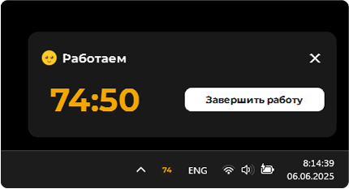
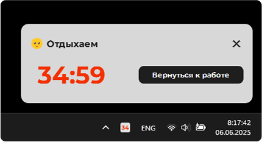
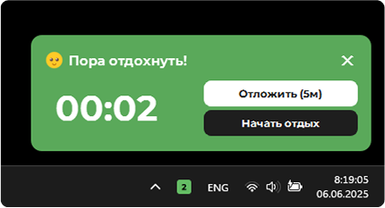
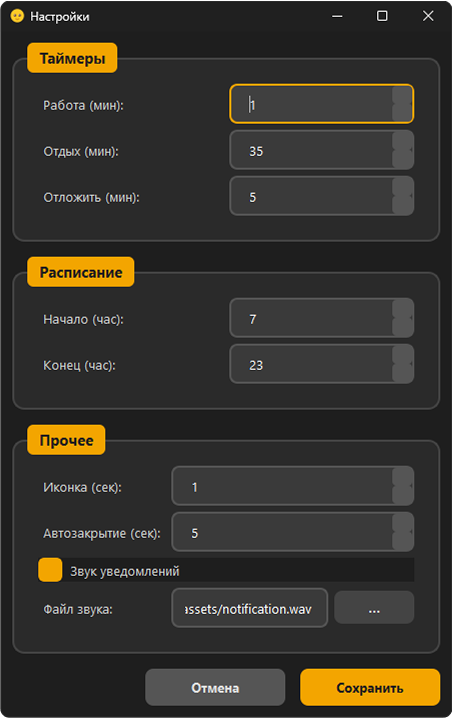

# ProcrastiNOT - Productivity Timer

> Таймер продуктивности, основанный на исследовании "британских учёных" о том, что идеальный ритм работы — это 75 минут труда и 33 минуты отдыха.



## ✨ Особенности

- 🎯 **Научно обоснованные интервалы**: 75 минут работы + 33 минуты отдыха
- 💎 **Красивые уведомления** с современным дизайном и анимациями
- 📊 **Динамическая иконка в трее** с цветовой индикацией режимов
- ⏰ **Умное расписание** с настройкой активных часов
- 🔄 **Отслеживание переработки** для контроля work-life balance
- 🎵 **Настраиваемые звуковые уведомления**
- ⚙️ **Гибкие настройки** под ваши потребности

## 🚀 Быстрый старт

### Системные требования

- Python 3.8+
- PyQt6
- Windows/macOS/Linux

### Установка

```bash
# Клонируем репозиторий
git clone https://github.com/Veta-one/ProcrastiNOT.git
cd ProcrastiNOT

# Устанавливаем зависимости
pip install -r requirements.txt

# Запускаем приложение
python ProcrastiNOT.py
```

### Файловая структура

```
ProcrastiNOT/
├── ProcrastiNOT.py         # Основной код приложения
├── settings.ini            # Конфигурационный файл (создается автоматически)
└── assets/                 # Ресурсы приложения
    ├── icon.png            # Иконка приложения
    └── notification.wav    # Звук уведомлений по умолчанию
```

## 🎨 Интерфейс

### Уведомления

ProcrastiNOT использует кастомные уведомления вместо стандартных системных попапов:

<div>
  
  <br />
  <em>Режим работы - тёмная тема с жёлтым акцентом</em>
    <br /><br /><br />
</div>

<div>
  
  <br />
  <em>Режим отдыха - светлая тема с красным акцентом</em>
    <br /><br /><br />
</div>

<div>
  
  <br />
  <em>Предложение отдохнуть - зелёная тема с кнопками выбора</em>
  <br /><br /><br />
</div>


### Иконка в системном трее

Динамически меняющаяся иконка показывает:
- **Число** - оставшиеся минуты (или секунды в последние моменты)
- **Цвет фона** - текущий режим:
  - 🟨 Жёлтый - режим работы
  - 🟥 Красный - режим отдыха  
  - 🟩 Зелёный - переработка
  - 🟧 Оранжевый - отсрочка отдыха
  - ⚫ Серый - сон (вне активных часов)

### Окно настроек



Полностью настраиваемые параметры:
- Длительность рабочих и отдыховых интервалов
- Время отсрочки отдыха
- Активные часы работы
- Частота обновления иконки
- Звуковые уведомления

## ⚙️ Конфигурация

### Настройки по умолчанию

```ini
[Timers]
work_minutes = 75
rest_minutes = 33
postpone_minutes = 5
sound_enabled = True
sound_file = assets/notification.wav
icon_update_rate_seconds = 1
notif_timeout = 5

[Schedule]
active_start_hour = 9
active_end_hour = 18
```

### Кастомизация звуков

Поддерживаются WAV-файлы. Можно выбрать свой звуковой файл через интерфейс настроек или прописать путь в `settings.ini`.

## 🔄 Режимы работы

### 1. Режим работы (Work)
- Отсчёт 75 минут
- Жёлтая иконка в трее
- Возможность досрочно завершить сессию

### 2. Режим отдыха (Rest)  
- Отсчёт 33 минут
- Красная иконка в трее
- Возможность вернуться к работе досрочно

### 3. Предложение отдохнуть (Rest Prompt)
- Появляется по завершении рабочей сессии
- Две опции: "Отложить на N минут" или "Начать отдых"
- Отслеживание времени переработки

### 4. Отсрочка (Postponed)
- Короткий интервал перед принудительным отдыхом
- Оранжевая иконка в трее

### 5. Сон (Inactive Hours)
- Автоматически активируется вне рабочих часов
- Серая иконка "Zzz" в трее

## 🎯 Философия

ProcrastiNOT разработан с принципом **ненавязчивости**:
- Не блокирует экран принудительно
- Предлагает выбор, а не диктует
- Показывает статистику переработки для осознанности
- Уважает ваше расписание и привычки

## 🛠 Разработка

### Архитектура

- **ConfigManager** - управление настройками и конфигурацией
- **CustomNotification** - кастомные уведомления с анимациями
- **SettingsWindow** - интерфейс настроек
- **ProductivityApp** - основная логика приложения

### Технические особенности

- Использует PyQt6 для нативного GUI
- Кастомная отрисовка иконок в системном трее
- Fade-in/fade-out анимации для уведомлений
- Обработка событий мыши для интерактивности
- Автосохранение настроек в INI-файл

### Сборка исполняемого файла

```bash
# Устанавливаем PyInstaller
pip install pyinstaller

# Собираем приложение
pyinstaller --onefile --windowed --add-data "assets;assets" ProcrastiNOT.py
```

## 🤝 Вклад в проект

Приветствуются:
- Баг-репорты и предложения функций
- Переводы на другие языки
- Улучшения UI/UX
- Оптимизации производительности

### Roadmap

- [ ] Статистика и аналитика сессий
- [ ] Интеграция с календарём
- [ ] Темы оформления
- [ ] Синхронизация между устройствами

## 📝 Лицензия

MIT License - используйте как угодно, но не забудьте поблагодарить британских учёных!

## 🙏 Благодарности

- Британским учёным за исследование соотношения 75:33
- Создателям PyQt6 за отличный фреймворк
- Сообществу за идеи и фидбек

---

*Made with ❤️ и много кофе во время 75-минутных сессий*
